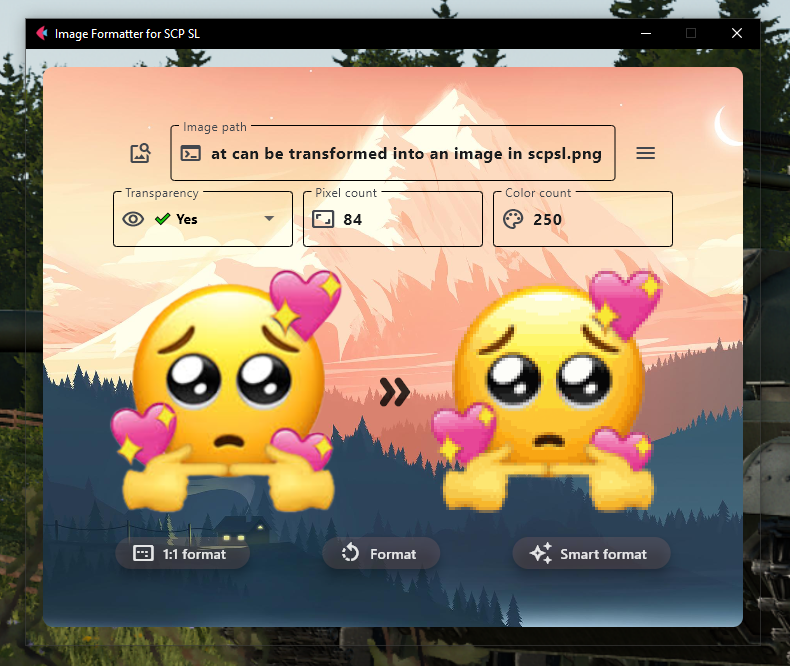
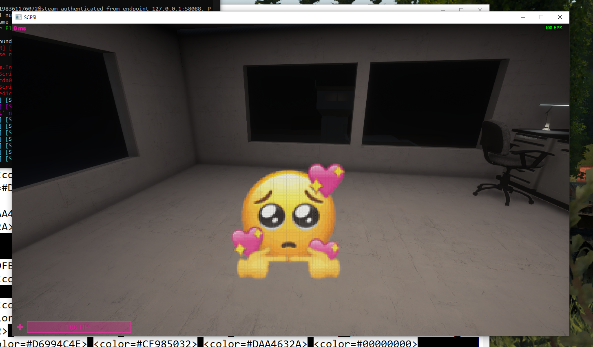

# Image Formatter for SCPSL

## Showcase

## Features
Support for images of type:
PNG, JPEG, PPM, GIF, TIFF, and BMP

- Smart formatting for the best picture quality
  
- Clean and intuitive UI

- Formatted image preview

## How to install
1. Download the exe file from the latest release.
2. Run the app.
3. App will launch with no background. If you have an internet connection, the background image should download.
4. Restart the app.
5. Done!

## Is this a virus?
__No.__ 
This project is using PyInstaller - a way to package python to an executable file. 
It unfortunetley causes Windows Defender and other antivirus software to mark it as a some sort of trojan.
If you know Python, just take a look at the code to know for yourself or run it on a Virtual Machine.

## The .exe does't work!
It's possible that the .exe file could not work due to problems with packaging .py into .exe. 
There isn't a lot that can be done, except for downloading the raw .py and running it using an IDE like VS Code.

### Background image used

